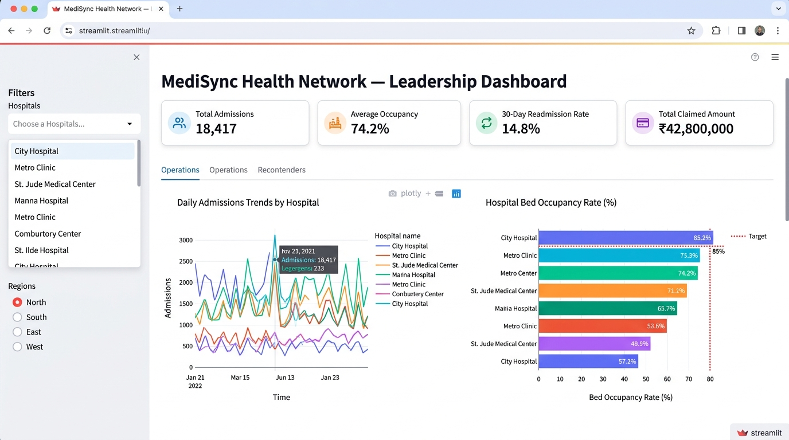
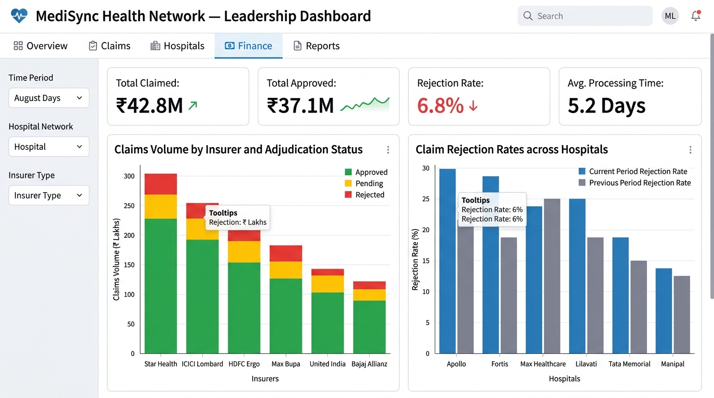

# MediSync Leadership Dashboard (Streamlit)

Interactive executive intelligence dashboard built with **Streamlit** and **Plotly** over the **MediSync Gold layer** Parquet tables. Provides real-time visibility into multi-hospital inpatient operations, clinical quality metrics, payer financial adjudications, and diagnostic pathology anomalies.

---

## 1. Quickstart & How to Run

### Prerequisites
Make sure dependencies are installed:
```bash
pip install -r requirements.txt
```

### Launch the Dashboard
Run the Streamlit application from the project root:
```bash
streamlit run dashboard/app.py
```
The application will automatically open in your default browser at:
`http://localhost:8501`

---

## 2. Dashboard Architecture & Security

- **Direct Gold Lakehouse Access**: Reads directly from local Parquet storage (`warehouse/gold/` or configurable via environment variables). Operates **100% offline** with zero external network or API calls.
- **Fail-Fast PII Assertion**: On initial load, the cached loader (`@st.cache_data`) asserts that no sensitive identifiers (`full_name`, `phone`, `email`, `national_id`) exist in any Gold table.
- **Zero-Traceback Edge Case Protection**: If a user clears all hospital or region filters, the dashboard renders an intuitive warning prompt instead of an application crash or stack trace.

---

## 3. Executive KPI Header & Global Filters

### Global Sidebar Filters
- **Geographic Region**: Scopes metrics to all regions or specific networks (`North`, `South`, `West`).
- **Hospital Facilities**: Dynamic multi-select facility filter updated by the active region selection.
- **Date Range Selector**: Calendar interval picker bounding all operational, quality, financial, and clinical metrics.

### Top-Level Executive KPI Cards
- **Total Admissions**: Total inpatient encounters recorded within the selected window.
- **Average Occupancy**: Network-wide bed utilization percentage.
- **30-Day Readmission Rate**: Overall percentage of discharged patients readmitted within 30 days.
- **Total Claimed Amount**: Aggregate INR value of insurance claims submitted across facilities.

---

## 4. Tabs Overview

### Tab 1: Operations (`gold_hospital_daily_admissions`)
- **Daily Admissions Trend (Line Chart)**: Tracks day-to-day inpatient admission counts per hospital facility to identify surge periods.
- **Bed Occupancy vs. Capacity (Bar Chart)**: Compares current facility bed occupancy percentages against the critical 85% operational capacity threshold line.
- **Average Length of Stay (Bar Chart)**: Visualizes mean stay duration (in days) across facilities to assess bed turnover efficiency.

### Tab 2: Quality (`gold_readmission_30d`)
- **Facility Readmission Rate (Bar Chart)**: Ranks hospitals descending by their 30-day post-discharge readmission rate.
- **Longitudinal Trend (Line Chart)**: Tracks monthly variations in readmission rates over time.
- **Granular Adjudication Table**: Tabular view of monthly index discharges, readmissions count, and computed rate per hospital.

### Tab 3: Finance (`gold_claims_summary`)
- **Financial KPIs**: Total claimed value, approved reimbursement value, and overall claim rejection percentage.
- **Payer Adjudication Status (Stacked Bar Chart)**: Decomposes claim volume by insurance carrier (ICICI Lombard, Star Health, Bajaj Allianz, etc.) across Approved, Pending, and Rejected statuses.
- **Rejection Rates by Payer & Hospital (Grouped Bar Chart)**: Pinpoints specific hospital-payer pairings experiencing disproportionate claim denials.

### Tab 4: Clinical (`gold_lab_abnormality`)
- **Pathology Abnormality Rate (Bar Chart)**: Rates test specimens falling outside reference intervals across key lab tests (Glucose, HbA1c, Creatinine, Cholesterol, Hemoglobin).
- **Hospital × Test Abnormality Heatmap**: Matrix correlating pathology abnormality rates across individual hospital facilities and diagnostic tests.
- **Top 10 Clinical Outliers Table**: Highlights highest-volume abnormal test combinations requiring clinical review.

---

## 5. Dashboard Screenshots

### Inpatient Operations View

*Figure 1: Real-time hospital admissions trends, bed occupancy tracking against the 85% threshold, and average stay durations.*

### Revenue Cycle & Payer Adjudication View

*Figure 2: Claims adjudication volumes by insurance carrier and comparative hospital rejection rates.*
